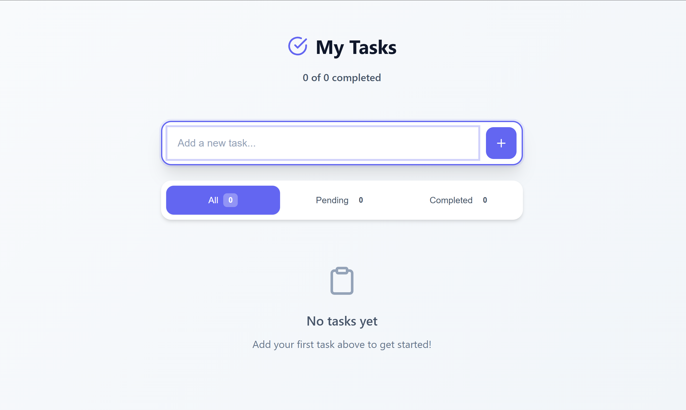

# Modern To-Do List Web Application

## Overview

This is a client-side to-do list application built with vanilla HTML, CSS, and JavaScript. The application features a modern, minimalistic design inspired by popular productivity apps like Notion, Apple Notes, and Google Tasks. It provides full CRUD functionality for task management with persistent storage using the browser's localStorage API.

## System Architecture

### Frontend Architecture
- **Vanilla JavaScript**: Uses ES6+ class-based architecture with a single `TodoApp` class managing the entire application state
- **Component-based approach**: Despite being vanilla JS, the code is organized into logical methods that handle specific UI components and interactions
- **Event-driven**: Uses DOM event listeners for user interactions and state changes
- **MVC-like pattern**: Separates data management, UI rendering, and user interaction handling

### Client-Side Storage
- **localStorage API**: Primary data persistence mechanism storing tasks as JSON
- **Auto-save functionality**: Automatic data persistence every 30 seconds to prevent data loss
- **Immediate persistence**: All CRUD operations immediately sync to localStorage

### UI Framework
- **Pure CSS**: Custom CSS with modern features including CSS custom properties (variables), flexbox, and animations
- **Responsive design**: Mobile-first approach with responsive breakpoints
- **Feather Icons**: External CDN-based icon library for consistent iconography

## Key Components

### Core Application Class (`TodoApp`)
- **State management**: Manages tasks array, current filter state, and UI state
- **DOM manipulation**: Handles all UI updates and rendering
- **Event handling**: Coordinates user interactions and system responses
- **Data persistence**: Manages localStorage operations

### UI Components
- **Header**: Displays app title and task completion counters
- **Add Task Section**: Input field and add button for creating new tasks
- **Filter Section**: Buttons for filtering tasks (All, Pending, Completed)
- **Tasks List**: Dynamic rendering of task items with CRUD operations
- **Modal System**: Edit and delete confirmation modals
- **Empty State**: Displays when no tasks match current filter

### Task Management Features
- **CRUD Operations**: Create, Read, Update, Delete tasks
- **Task Filtering**: Filter by all, pending, or completed status
- **Real-time Counters**: Live updates of task statistics
- **In-place Editing**: Modal-based task editing
- **Confirmation Dialogs**: Safe deletion with user confirmation

## Data Flow

### Task Creation
1. User inputs task text and clicks add or presses Enter
2. Validation ensures non-empty input
3. New task object created with unique ID and metadata
4. Task added to application state array
5. UI re-rendered to show new task
6. Data persisted to localStorage

### Task Updates
1. User clicks edit button on task item
2. Edit modal opens with current task text
3. User modifies text and saves
4. Task object updated in application state
5. UI re-rendered with updated task
6. Changes persisted to localStorage

### State Synchronization
- All UI updates trigger counter recalculation
- Filter changes re-render the tasks list
- Every state change immediately persists to localStorage
- Auto-save backup every 30 seconds

## External Dependencies

### CDN Dependencies
- **Feather Icons**: `https://unpkg.com/feather-icons` - Provides modern, lightweight SVG icons
  - Used for: UI icons (check-circle, plus, edit, trash, etc.)
  - Alternative considered: Font Awesome, but Feather was chosen for smaller bundle size

### Browser APIs
- **localStorage API**: Client-side data persistence
- **DOM API**: Direct DOM manipulation without frameworks
- **Event API**: User interaction handling

## Deployment Strategy

### Static Hosting Ready
- **No build process**: Application runs directly in browser without compilation
- **CDN compatible**: All assets can be served from static file hosting
- **Progressive Enhancement**: Core functionality works without JavaScript (basic HTML structure)

### Hosting Options
- **Static hosting services**: Netlify, Vercel, GitHub Pages
- **CDN deployment**: Cloudflare Pages, AWS S3 + CloudFront
- **Traditional web hosting**: Any HTTP server capable of serving static files

### Performance Considerations
- **No external frameworks**: Minimal JavaScript bundle size
- **Inline styles**: CSS embedded in single file for faster loading
- **Lazy icon loading**: Feather icons loaded from CDN but initialized after DOM ready

## Changelog

- June 29, 2025. Initial setup

## User Preferences

Preferred communication style: Simple, everyday language.

## Screenshots

### Application Interface

The application features:
- Clean, modern header with task completion counters
- Intuitive input field with add button for creating new tasks
- Filter buttons (All, Pending, Completed) with live count badges
- Task list with checkboxes, edit/delete actions, and timestamps
- Responsive design that works on all screen sizes
- Smooth animations and hover effects throughout
